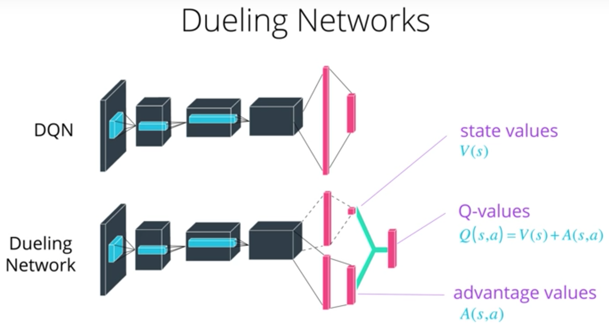

### A peek into the banana world!
Before building an agent that learns, you can test out an agent that selects actions (uniformly) at random at each time 
step. Run the code in the block [here]() in the `Navigation.ipynb` file of the source code. The agent will most likely 
not produce scores higher 2 with these settings obviously.

### Reinforcement Learning (RL): A recap

In RL, an agent can be trained to find the optimal policy that will decide which actions to take in an environment to 
maximise rewards. Since the effects of possible actions are initially unknown, the optimal policy must be discovered 
by interacting with the environment and recording observations. Therefore, the agent "learns" the policy through a 
process of trial-and-error that iteratively maps various environment states to the actions that yield the highest 
reward. This type of algorithm is called **Q-Learning**, Q standing for the "table" that maps state, action pairs to the
best known action to take in a given environment.

Deep RL tries to approximate Q tables with neural networks, to leverage their learning potential in more complex 
scenarios and environments.

Let's recap on the theory behind the components that are used here.

### DQN

#### Q-function
To discover an optimal policy, a Q-function is set up. The Q-function calculates the expected reward `R` for all 
possible actions `A` in all possible states `S`.


We can then define our optimal policy `π*` as the action that maximizes the Q-function for a given state across all 
possible states. The optimal Q-function `Q*(s,a)` maximizes the total expected reward for an agent starting in state `s`
and choosing action `a`, then following the optimal policy for each subsequent state.


In order to discount returns at future time steps, the Q-function can be expanded to include the hyper-parameter gamma 
`γ`.


#### Epsilon-greedy algorithm

Choosing an action, while the agent is still unaware of the optimal policy, can be challenging. Should the agent explore
entirely new actions while in previously visited states, or exploit what he knows thus far. You realize that, in the 
case of choosing the latter over the former, if the agent is still at its infancy, it won't be able to effectively 
learn anything new. This falls into the **exploration-exploitation** dilemma. One way to overcome this is through the 
Epsilon-greedy algorithm.

This algorithm introduces some stochasticity in the learning approach. By setting a fixed/decaying probability `𝛜` 
when choosing random actions, we allow the agent to "explore" further possible actions. However, the agent needs to also
capitalize on its currently amassed knowledge, hence why the already known, best actions are selected with probability 
(1-𝛜).

By decaying probability, we mean the decrease of the initial value of epsilon over time, so that the agent will favour
exploration early on and exploitation later on, as it will have gained enough experience to know which actions are best
taken at that point.

#### Deep Neural Nets

To approximate the Q-function in this experiment, we use a deep neural network. 
Given a network `F`, finding an optimal policy is a matter of finding the best weights `w` such that `F(s,a,w) ≈ Q(s,a)`.
The weights `w` are learned through gradient descent, during the back-propagation step of a neural net's training 
procedure.

The neural network architecture used for this project can be found 
[here]() in the `model.py` file of the source code. 
The network contains three fully connected layers with 128, 128, and 4 nodes respectively. 

#### Experience replay

To make sure that we-reuse previously knowledge from previously visited experiences, expressed as a tuple of state, action,
reward and next state pairs `(s, a, r, s')`, we record them in a Replay Buffer (RB) and randomly sample from them to eliminate
sequential correlations that might have been captured in our neural nets. This prevents action values from oscillating 
or diverging catastrophically.

#### Double DQN (DDQN)

To avoid over-estimations of Q-values, we have run experiments using Double DQN as well [1]. Double Q-learning reduces
over-estimations by decomposing the max operation in the target into action selection and action evaluation. 
Although not fully decoupled, the target network in the DQN architecture provides a natural 
candidate for the second value function, without having to introduce additional networks. In our implementation, and the
referenced table, we evaluate the greedy policy according to the online network, but using the target network to 
estimate its value.

#### Dueling Agents

Dueling networks [2] utilize two streams: one that estimates the state value function `V(s)`, and another that estimates 
the advantage for each action `A(s,a)`. These two values are then combined to obtain the desired Q-values.  



The reasoning behind this approach is that state values don't change much across actions, so it makes sense to estimate 
them directly. However, we still want to measure the impact that individual actions have in each state, hence the need 
for the advantage function.

The dueling agents are implemented within the fully connected layers [here]() in the `model.py` file of the source code.

### DQN parameters and results

The DQN agent uses the following parameters values (defined in dqn_agent.py)

```
BUFFER_SIZE = int(1e5)  # replay buffer size
BATCH_SIZE = 64         # minibatch size (Initially 64)
GAMMA = 0.99           # discount factor (Initially 0.99)
TAU = 1e-3              # for soft update of target parameters
LR = 5e-4               # learning rate (Initially 5e-4)
UPDATE_EVERY = 4        # how often to update the network
```

The Neural Networks use the following architecture :

```
Input nodes (37) -> Fully Connected Layer (128 nodes, Relu activation) -> Fully Connected Layer (128 nodes, Relu activation) -> Ouput nodes (4)
```

The Neural Networks use the Adam optimizer with a learning rate LR=5e-4 and are trained using a BATCH_SIZE=64

Given the chosen architecture and parameters, our results show that DDQNs perform better than the vanilla DQN or the 
Dueling networks by a small margin.

| Algorithm | Episodes Req to PASS (>=13) | Total training time (min) | Img  |
| ----- | --------------------------- | ------------------------------ | ---- |
| Vanilla  | 507                         | **14.4**                          | 1    |
| DDQN  | **410**                         | 16.1                          | 2    |
| Dueling  | 440                         | 14.7                          | 3    |

### Future work

#### Implementing Prioritized Experience Replay (PER).
Experience replay lets online reinforcement learning agents remember and reuse experiences 
from the past. In prior work, experience transitions were uniformly sampled from a replay 
memory. However, this approach simply replays transitions at the same frequency that they 
were originally experienced, regardless of their significance. To replay important transitions
more frequently, and therefore learn more efficiently, we can use PER.

#### References

* [1] Deep Reinforcement Learning with Double Q-learning (https://arxiv.org/abs/1509.06461)
* [2] Dueling Network Architectures for Deep Reinforcement Learning
